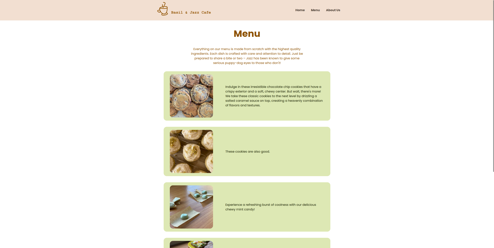

# Basil and Jazz Cafe Page
This is a Cafe Web Page inspired by my cat, dog and my love for cooking.

## Live Demo
[You can visit the website 'Basil and Jazz Cafe' here](https://emilijamarija.github.io/cafe-page)

## Built with
- Vanilla JS
- CSS3
- Webpack 5

## Goals
This project was in part completed for an [assignment on The Odin Project](https://www.theodinproject.com/lessons/node-path-javascript-restaurant-page). My goals were to:
1. practice DOM manipulation with JavaScript, without relying on any framework,
2. write an application without the help of external libraries,
3. learn to set up and configure Webpack to load assets and manage output,
4. make the website accessible and responsive.

In addition to the requirements of the aforementioned assignment, I set up a pure JavaScript router to listen for URI changes and reload the page accordingly. That is also why I have made a 404 error page.

## Design
All photographs and icons used throughout the project were made by me. The color palette was chosen with the help of Material 3 - Google's design system.

## Getting Started
If you'd like to run this project on your own machine, you will need to:
1. Clone this project
2. Install the required dependencies by running

    `npm install`

3. Run the project with 

    `npm run dev`

You can then open up a live demo on any device in your network with the port number 8080.
